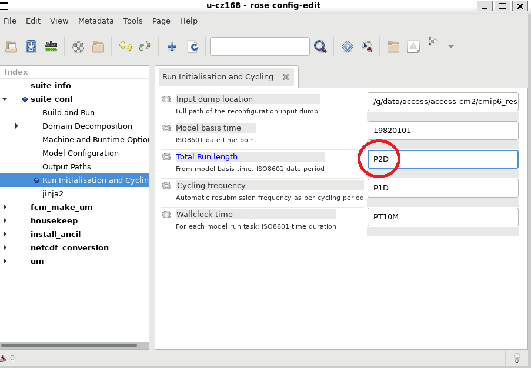

# ACCESS-NRI Workshop rose cylc examples
<p>Guide for the rose cylc ACCESS-NRI workshop exercises.</p>

# Exercise 1:  Changing the run length
The previous run was only for a single day. A simple exercise is to change this to a 2 day run.

```
cd ~/roses/u-cz168
rose edit
```

In a well designed suite many of the run parameters you are most likely to want to change are set in the suite `rose-suite.conf` file and show in the `suite conf` section of the GUI.

<p align="center"></p>

After saving you can run this from the GUI, or from the command line as before
<p align="center"></p>

After completion you should see files for the second day in the log and archive directories.

Because the suite is a repository you can also see the changes `rose edit` made by running `svn diff`. If you'd created a new suite rather than just taken a copy these could be committed.

```
% svn diff
Index: rose-suite.conf
===================================================================
--- rose-suite.conf     (revision 265663)
+++ rose-suite.conf     (working copy)
@@ -22,6 +22,6 @@
 RUN=true
 RUNID=true
 !!RUNID_USR=''
-RUNLEN='P1D'
+RUNLEN='P2D'
 UM_OPT_KEYS='daily'
 USE_STD_EXEC=true
 ```

## [Exercise 2:  Changing a model physics option](ex2_co2.md)
