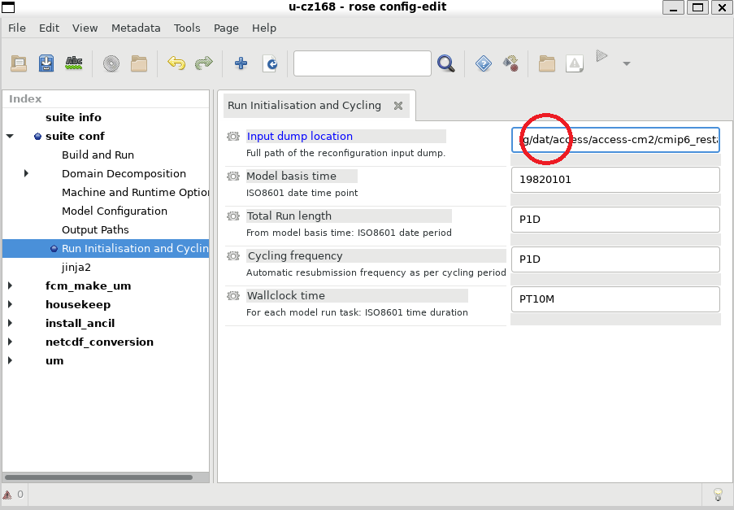
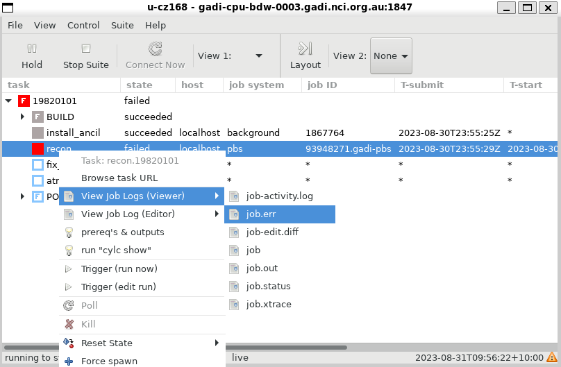
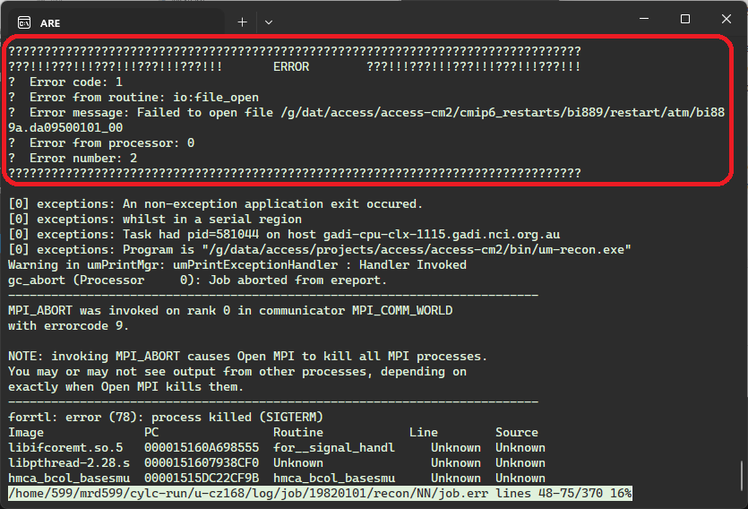
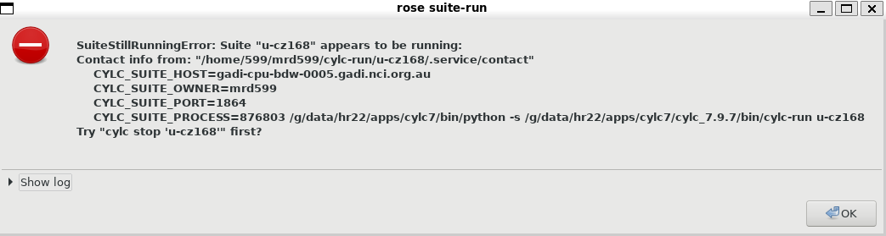
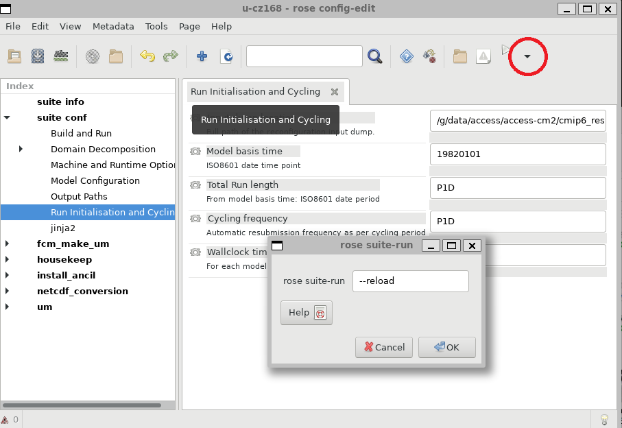
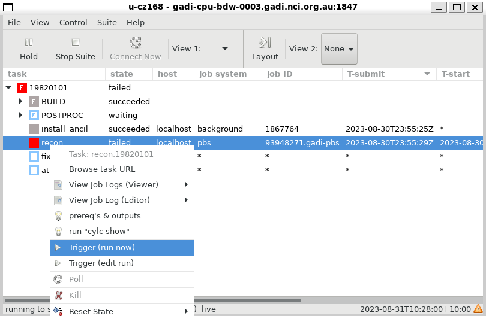

# ACCESS-NRI Workshop rose cylc examples
<p>Guide for the rose cylc ACCESS-NRI workshop exercises.</p>

# Exercise 3: Troubleshooting example
Actual error messages from the UM can be hard to find. As a test, suppose the path to the initial dump is set incorrectly.

<p align="center"></p>

The recon step will fail. In the GUI right click on the task to bring up a menu and see the job error log
<p align="center"></p>

Alternately you can see it directly on the file system
```
less ~/cylc-run/u-cz168/log/job/19820101/recon/NN/job.err
```

The actual useful error message is in the middle of the file, followed by a lot of job traceback that isn't useful in this case.
<p align="center"></p>

The `job.out` file has the same error message, though this isn't always the case.

Rather than rerunning the suite from the start, cylc makes it easy to rerun the failed task after fixing the error. However just running will give an error

<p align="center"></p>

Instead you need the reload option
<p align="center"></p>

Then rerun the failed task from the GUI
<p align="center"></p>
and the suite will proceed to completion.

Alternately this can be done from the command line
```
rose suite-run --reload
cylc trigger u-cz168 19820101/recon
```

There are now suite logs for multiple runs of the task (`NN` always points to the latest).

```
% ls -l ~/cylc-run/u-cz168/log/job/19820101/recon/
total 8
drwxr-sr-x 2 mrd599 tm70 4096 Aug 31 09:56 01
drwxr-sr-x 2 mrd599 tm70 4096 Aug 31 10:35 02
lrwxrwxrwx 1 mrd599 tm70    2 Aug 31 10:37 NN -> 02
```
