# ACCESS-NRI Workshop rose cylc examples
<p>Guide for the rose cylc ACCESS-NRI workshop exercises.</p>

## Step 0: Pre-workshop
Join the access, hh5, hr22, ki32 and nf33 projects.

The exercises will still work if you do not have a MOSRS account

## Step 1:
Go to the [Australian Research Environment](https://are.nci.org.au/) website and login with your **NCI username and password**. If you don't have an NCI account, you can sign up for one at the [NCI website](https://my.nci.org.au/mancini/login?next=/mancini/).

<p align="center">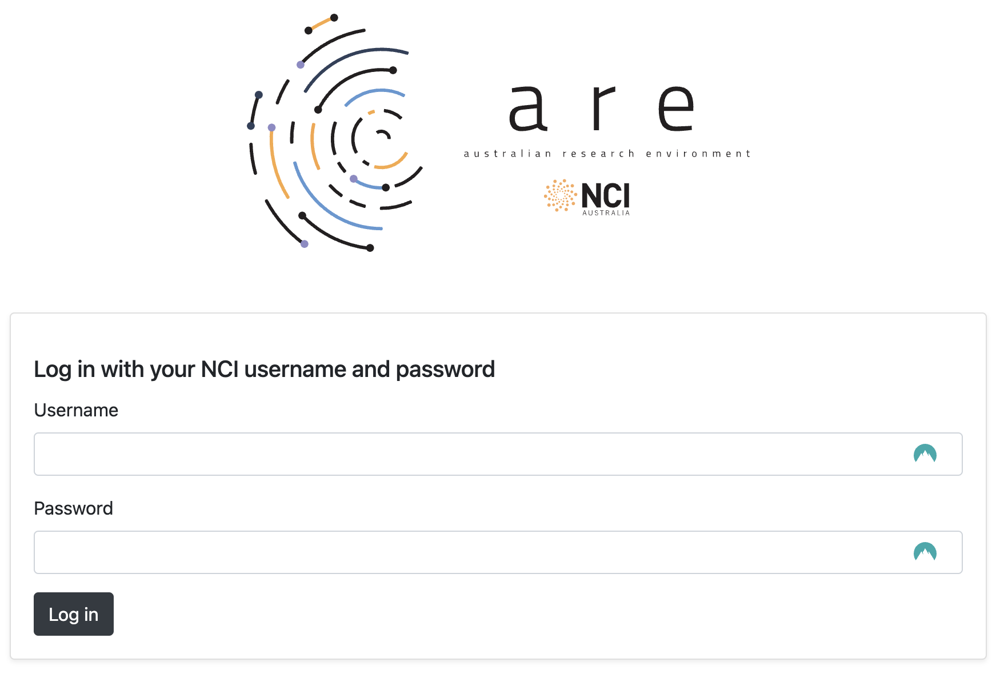</p>

## Step 2:
Click on `Virtual Desktop` under *Featured Apps* to configure a new VDI instance. This option is also available under the *All Apps* section at the bottom of the page and the *Interactive Apps* dropdown located in the top menu.

<p align="center">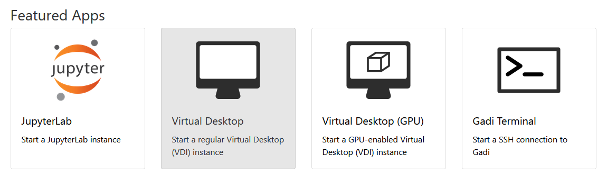</p>

## Step 3:
You will now be presented with the main VDI instance configuration form. Please complete **only** the fields below - leave all other fields blank or to their default values.

- *3.1* **Walltime**: The number of hours the VDI instance will run. `3` hours is sufficient for this workshop session.

<p align="center">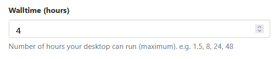</p>

- *3.2* **Compute Size**: Select `Tiny (1 cpus, 4.5G mem)` from the dropdown menu.

<p align="center">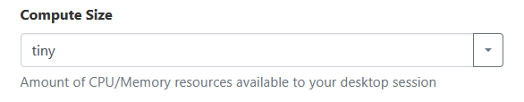</p>

- *3.3* **Project**: Please enter `nf33`. This will allocate SU usage to the workshop project.

<p align="center">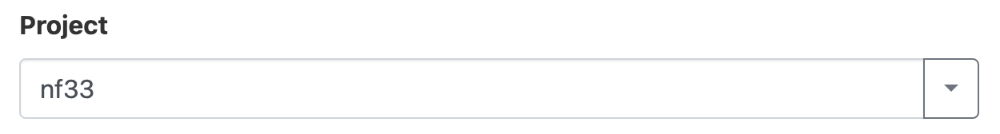</p>

- *3.4* **Storage**: This is the list of `/g/data/` project data storage locations required to complete the workshop tutorials. In ARE, storage locations need to be explicitly defined to access these data from within a VDI instance. Please enter the following string listing the projects mentioned in **Step 0** above: `gdata/access+gdata/hh5+gdata/hr22+gdata/ki32`.

<p align="center">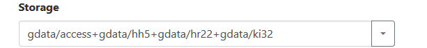</p>

- *3.5* Click `Advanced options ...`
  * Optional: You can check the box here to receive an email notification when your VDI instance starts, but as we are only running relatively small instances, they will spin up quickly and this probably isn't necessary.</p>

<p align="center"></p>

- *3.6* Click `Launch` to start your VDI Instance.

<p align="center">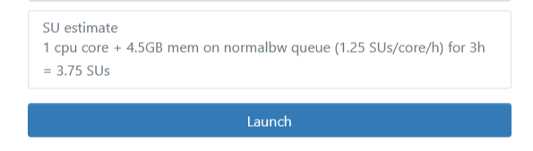</p>

## Step 4:
Once you have clicked `Launch` the browser will redirect to the 'interactive sessions' page where you will see your VDI instance details and current status which will look something like this:

<p align="center">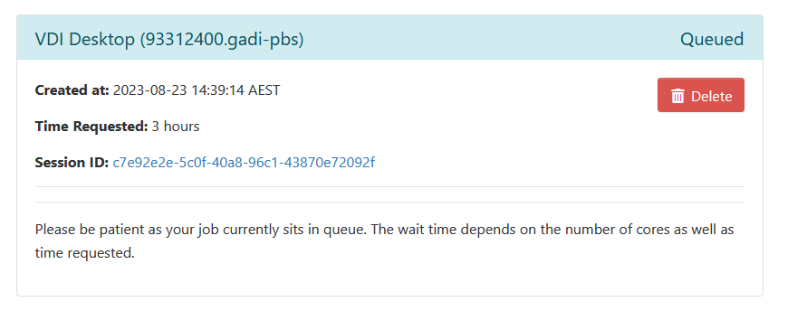</p>

Once the VDI instance has started (this usually takes around 30 seconds) and this status window should update and look something like the following, reporting that the instance has started and the time remaining. More detailed information on the instance can be accessed by clicking the `Session ID` link.

<p align="center">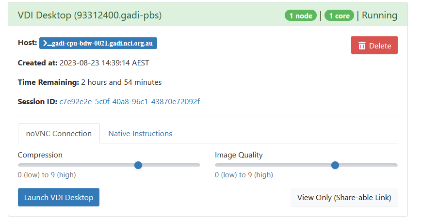</p>

All that remains to get started is to click `Launch VDI Desktop`.

#  Running the example suite

Start a terminal in the VDI session (from icon at top left).

Note that pasting externally copied text into the VDI terminal is quite awkward. See https://github.com/ACCESS-NRI/workshop-training-2023/issues/22 for a workaround.

```
module use /g/data/hr22/modulefiles
module load cylc7
```

If you have a MOSRS account

```
mosrs-auth
rosie co u-cz168
```
This checks out a copy of the suite to `~/roses/u-cz168`.

If you do not have a MOSRS account
```
mkdir -p ~/roses
cp -r /g/data/access/nri_training/u-cz168 ~/roses
```

This example is a ACCESS-CM2 like AMIP (atmosphere only) suite, but uses lower horizontal resolution and runs a day at a time rather than 6 months at a time.
```
cd ~/roses/u-cz168
rose suite-run
```

You should now see something like this
<p align="center">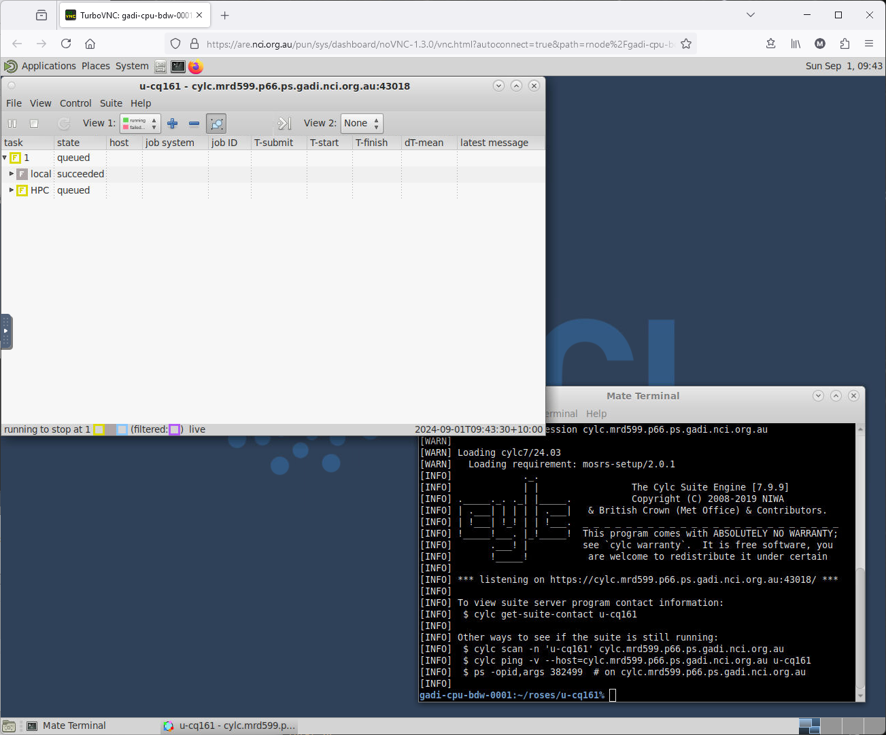</p>

This should only take a few minutes to complete. Note that tasks disappear from the GUI after they and their successors complete, so at the end of a successful run you'll be left with an empty GUI.
<p align="center">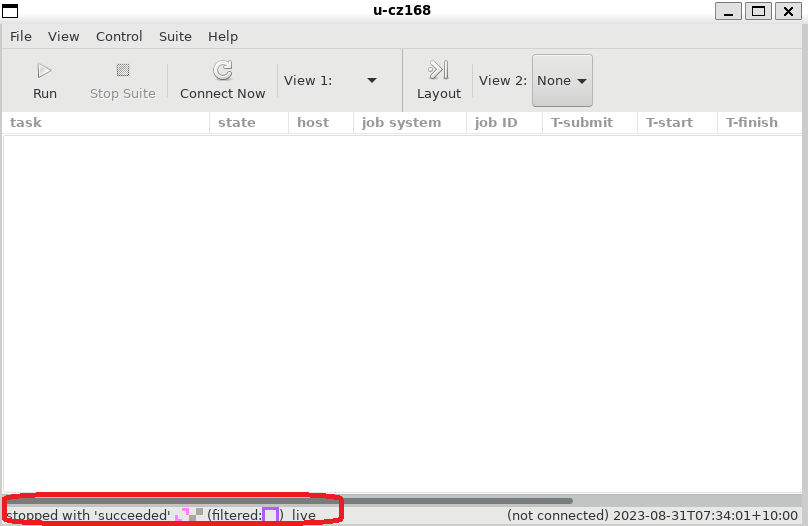</p>

## Suite output
The model output and log files can be checked directly on the file system. E.g.
<p align="center">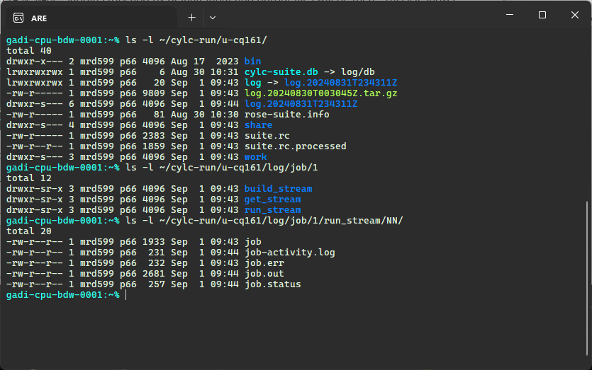</p>

Note that for suites launched from ARE, the whole `cylc-run/SUITE` directory is on `/scratch`, not just the `work` and `share` subdirectories.

## Model run directory
Tasks run in a `work/CYCLE_TIME/TASK_NAME` subdirectory and by default input and output files will be there. This list shows the model run directory while it is in progress (before the post-processing moves files)

<p align="center">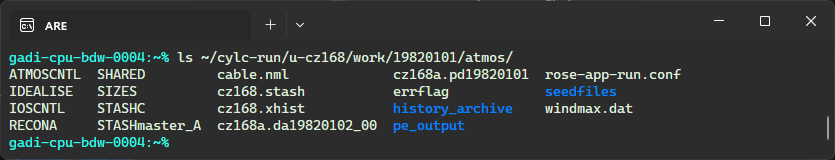</p>

`ATMOSCNTL` is a model namelist, created from the suite `app/um/rose-app.conf` file.

`cz168a.da19820102_00` is the restart file written at the end of the first day.

`cz168a.pd19820101` is a UM diagnostic (STASH) file.

## Model output
This section describes the archive strategy used by ACCESS-CM2. Other models will have a different style for both naming and saving files.

<p align="center">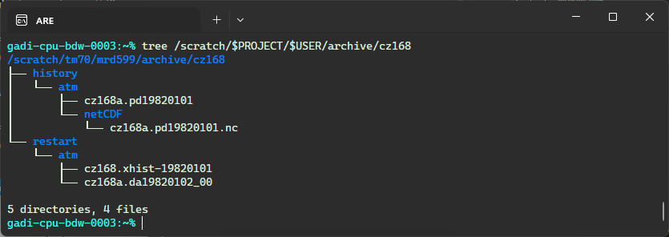</p>

Files in `history/atm` are UM fieldsfiles and can be read by `xconv` or by iris from within python. However the suite also converts to netCDF. Standard short names aren't available for all UM variables, so a STASH code based name is used. E.g. try
```
module use /g/data/hh5/public/modules
module load conda/analysis3
ncdump -c /scratch/$PROJECT/$USER/archive/cz168/history/atm/netCDF/cz168a.pd19820101.nc
```

Normally we'd recommend model analysis and plotting be done with a jupyter notebook, but a very simple stand-alone script is `/g/data/access/nri_training/simple_plot.py`. Try for example (you can ignore the Qt or libGL warning messages)
```
% python /g/data/access/nri_training/simple_plot.py  /scratch/$PROJECT/$USER/archive/cz168/history/atm/netCDF/cz168a.pd19820101.nc fld_s03i236
```
or with the original UM output
```
module use ~access/modules
module load xconv
xconv -i /scratch/$PROJECT/$USER/archive/cz168/history/atm/cz168a.pd19820101
```
With xconv, double click a variable to select and then choose `Plot Data`.

This run saves only daily data to the `pd` files. The full ACCESS-CM2 also saves monthly means to `pm` files and optionally also higher frequency data as required by CMIP6

## Suite structure
A suite is a directory in the MOSRS roses subversion repository. It contains the model science configuration, compute details and task dependencies. All files are plain text.
<p align="center">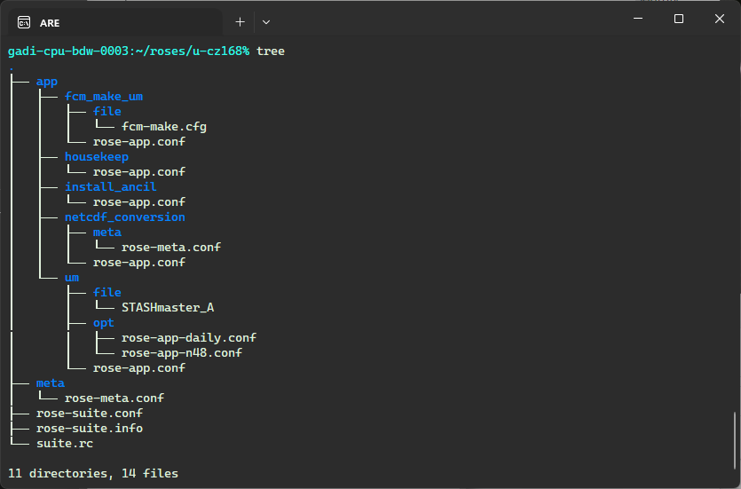</p>

## Rose/cylc exercises
[1: Changing run length](ex1_runlength.md)

[2:  Changing a model physics option](ex2_co2.md)

[3: Troubleshooting](ex3_troubleshooting.md)
