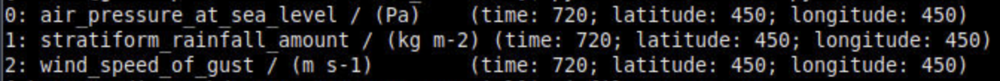

# ACCESS-NRI Workshop regional model examples
<p>Guide for the regional model ACCESS-NRI workshop exercises.</p>


# Exercise 1:  List the contents of the FieldsFile
The standard output for the Unified Model is in FieldsFile format.

To list the contents of a FieldsFile file, do the following


```
module use /g/data/hh5/public/modules
module load conda/analysis3
```

open a file called "list_contents.py"

and insert the following python code into it.

```
import iris
import sys
from pathlib import Path

fname="/scratch/nf33/<user>/cylc-run/u-dg768/share/cycle/20220226T0000Z/Lismore/d0198/RAL3P2/um/umnsaa_pb000"

if Path(fname).exists():
    d = iris.load(fname)
    print(d)

```

<p align="center"></p>

## [Exercise 2:  Changing a model physics option](ex2_co2.md)
