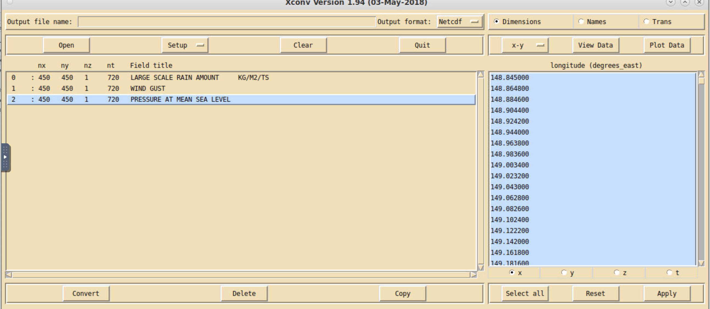

# ACCESS-NRI Workshop regional model examples
<p>Guide for the regional model ACCESS-NRI workshop exercises.</p>


# Exercise 1:  List the contents of the FieldsFile
The standard output for the Unified Model is in FieldsFile format.

To list the contents of a FieldsFile file, do the following


```
module use ~access/modules
module load xconv
```

go to an output directory of interest and list the files

```
cd /scratch/nf33/<user>/cylc-run/u-dg768/share/cycle/20220226T0000Z/Lismore/d0198/RAL3P2/um/
ls

```

then run

```
xconv umnsaa_pb000
```

A window will pop-up displaying the contents of the fieldsfile.

<p align="center"></p>

## [Exercise 2:  List contents of a fields file](list_file_contents.md)
