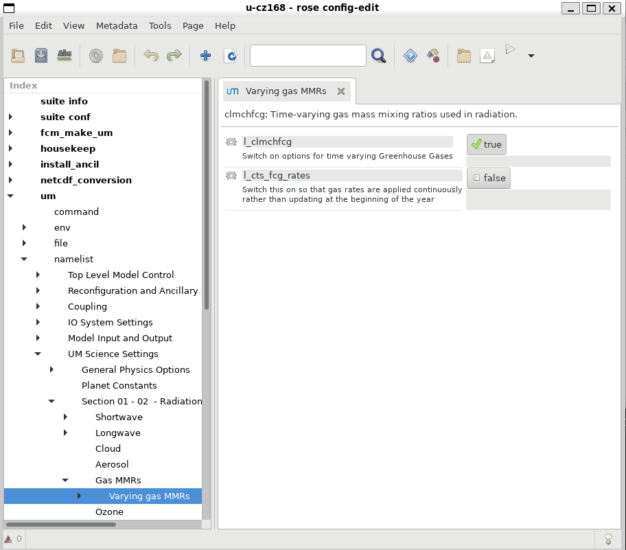
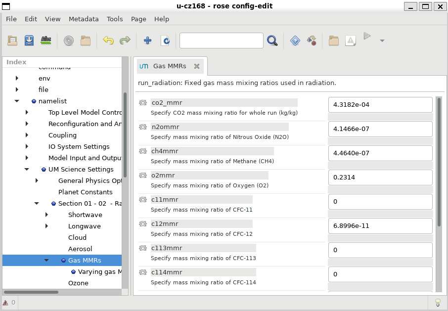

# ACCESS-NRI Workshop rose cylc examples
<p>Guide for the rose cylc ACCESS-NRI workshop exercises.</p>


# Exercise 2:  Changing a model physics option
This suite uses historical values of greenhouse gases. For an experiment we could turn this off and rerun with a greatly increased CO2 concentration (similar to the CMIP instantaneous 4xCO2 experiment).

Turn this option off

<p align="center"></p>

Then in the GAS MMRs section increase the CO2 mixing ratio. Note this is a mass mixing ratio rather than the more familiar volume ratio. 4.3182e-4 is the CMIP6 PI control value, equivalent to 284 ppmv. Perhaps multiply by 4.

<p align="center"></p>

Now rerun the suite. This will overwrite your previous output. However results can be compared to a saved copy of the output from the standard run in ` /g/data/access/nri_training/archive/cz168/`.

```
module use /g/data/hh5/public/modules
module load conda/analysis3
cdo sub  /scratch/$PROJECT/$USER/archive/cz168/history/atm/netCDF/cz168a.pd19820101.nc /g/data/access/nri_training/archive/cz168/history/atm/netCDF/cz168a.pd19820101.nc diff.nc
python /g/data/access/nri_training/simple_plot.py diff.nc fld_s02i206
```
The upward LW radiation is immediately affected by the CO2 change.

## [Exercise 3: Troubleshooting](ex3_troubleshooting.md)
