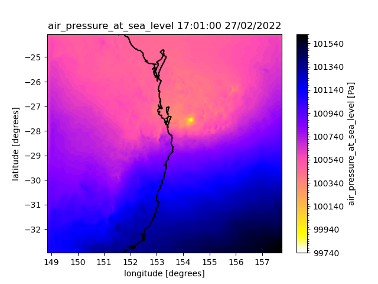

# ACCESS-NRI Workshop regional model examples
<p>Guide for the regional model ACCESS-NRI workshop exercises.</p>

# Exercise 2:   Creating a simple plot of a variable
Once you know the name of the variable of interest in a FieldsFile, it is fairly simple to read in that data into an Xarray variable.  Xarray can then be used to simply plot the variable.

If the python modules have not yet been loaded, load the necessary modules.

```
module use /g/data/hh5/public/modules
module load conda/analysis3
```

open a file called "simple_plot_MSLP.py"

and insert the following python code into it.

```
#!/usr/bin/env python
import xarray as xr
import matplotlib.pyplot as plt
import iris

basedir="/scratch/nf33/<user>/cylc-run/u-dg768/share/cycle/20220227T0000Z/Lismore/d0198/RAL3P2/um/"
data_fname=basedir+"umnsaa_pb012"
mask_fname=basedir+"umnsaa_pa000"

# Variable of interest
var="air_pressure_at_sea_level"

# Time-point of interest
TM=300

# Read in the data
d = iris.load(data_fname,var)

# Convert to an x-array object
d = xr.DataArray.from_iris(d[0])

# prepare commenting and plotting information
times = d['time'].dt.strftime("%H:%M:%S %d/%m/%Y").data
time_string = times[TM]
long_name = d.standard_name
cmap = plt.colormaps['gnuplot2_r']

# Plot the data
d[TM,:,:].plot.contourf(cmap=cmap,levels=100)

# Overwrite the plot title
plt.title(long_name+' '+time_string)

var = "land_binary_mask"
d = iris.load(mask_fname,var)
d = xr.DataArray.from_iris(d[0])
lons = d['longitude'].data
lats = d['latitude'].data
plt.contour(lons,lats,d[:,:].data,levels=[0.5],colors=['k'])
plt.show()

```

then run

```
python simple_plot_MSLP.py
```

The contents of the fieldsfile will then be printed out allowing you to see the available varibles.

<p align="center"></p>

